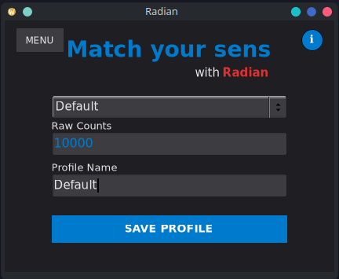

# Radian

Gaming sensitivity calibration tool for Linux.

Radian helps gamers match their mouse sensitivity across different games by measuring the raw mouse counts needed for a complete 360-degree rotation, allowing you to maintain consistent aim across any game.



## Why Radian exists?

If you play shooters often and you come from Windows, there is a fair chance you know Kovaaks the Aim Trainer. While not so known, Kovaaks also developed Sensitivity Matcher which is essentially what Radian tries to port to Linux. While Radian is slighty simpler, the main functionality is there. :)

## Features

- Test 360-degree rotations with a single keypress
- Fine-tune sensitivity with keyboard shortcuts while in game
- Save and manage multiple sensitivity profiles
- Customizable hotkeys

## How It Works

Radian interfaces directly with the Linux kernel's input subsystem:

- **Keyboard monitoring**: Reads from `/dev/input/eventX` devices using `libevdev` to detect global hotkeys even when other applications are in focus
- **Mouse injection**: Creates a virtual mouse device via `/dev/uinput` to generate precise horizontal movement for calibration
- **Configuration storage**: Saves settings and profiles to `~/.config/radian/radian.cfg` following XDG standards

## Installation

### Flatpak (Recommended - Coming Soon)

Pending approval on Flathub. Once available:

```bash
flatpak install flathub io.github.diabloget.radian
```

### AppImage (Available Now)

1. Download `radian-x86_64.AppImage` from [Releases](https://github.com/diabloget/radian/releases)
2. Make executable: `chmod +x radian-x86_64.AppImage`
3. Run: `./radian-x86_64.AppImage`

### Required Permissions

Radian needs access to input devices. On first run, you'll see a setup dialog. Run this command:

```bash
sudo usermod -aG input $USER
```

Then **log out and log back in** for the change to take effect.

**Why these permissions?**
- Reading keyboard input requires access to `/dev/input/eventX` (same as Discord for global hotkeys)
- Creating virtual mouse requires access to `/dev/uinput` (same as game recording software)

## Usage

### Quick Start

1. Launch Radian
2. Start your game
3. Press **8** to test a 360° rotation (default keybind)
4. Adjust with **0** (increase) / **9** (decrease) until you get exactly 360°
5. Save the profile with your game name
6. Use the raw count value to match sensitivity across other games

### Default Controls

- **8** > Test 360° rotation
- **0** > Increase (+50 counts)
- **9** > Decrease (-50 counts)
- **=** > Fine tune up (+1 count)
- **-** > Fine tune down (-1 count)
- **Backspace** > Cancel movement

All keybinds can be customized in the MENU.

### Profile Management

Profiles are saved in Radian's config file.

- **Config location**: `~/.config/radian/radian.cfg`
- **Format**:
  - Line 1: Keybind codes (space-separated integers)
  - Lines 2+: Profiles in CSV format: `Name,Counts`

Example:
```
8 48 9 13 12 14
Default,10000
CS2,8234
Valorant,9500
```

## Building from Source

### System Requirements

- Linux with kernel 4.5+ (uinput support)
- FLTK 1.4+ (Wayland support required)
- libevdev
- Development tools (gcc, make, pkg-config)

### Dependencies

Note: This App was built in Solus. Follow Fedora or Ubuntu dependency installations with caution since there is a high chance one of the packages is named differently.

#### Solus OS

```bash
# Development tools
sudo eopkg install -c system.devel

# Required libraries
sudo eopkg install libevdev-devel wayland-devel wayland-protocols-devel \
                   libxkbcommon-devel libcairo-devel pango-devel \
                   dbus-devel libpng-devel
```

#### Ubuntu/Debian

```bash
sudo apt install build-essential libevdev-dev \
                 libwayland-dev wayland-protocols libxkbcommon-dev \
                 libcairo2-dev libpango1.0-dev libdbus-1-dev libpng-dev
```

#### Fedora

```bash
sudo dnf install gcc-c++ make libevdev-devel \
                 wayland-devel wayland-protocols-devel libxkbcommon-devel \
                 cairo-devel pango-devel dbus-devel libpng-devel
```

### Building FLTK 1.4 (Required)

**Important:** Most distributions ship FLTK 1.3, which lacks native Wayland support. You need to compile FLTK 1.4 from source.

If your distribution already has FLTK 1.4+, you can skip this step and modify the `Makefile` to use your system's `fltk-config`.

```bash
# Clone FLTK
git clone https://github.com/fltk/fltk.git
cd fltk
mkdir build && cd build

# Configure for static linking + Wayland
cmake .. -G Ninja \
   -DCMAKE_BUILD_TYPE=Release \
   -DFLTK_BUILD_SHARED_LIBS=OFF \
   -DFLTK_BUILD_STATIC=ON \
   -DCMAKE_POSITION_INDEPENDENT_CODE=ON \
   -DCMAKE_INSTALL_PREFIX=/usr/local \
   -DFLTK_BUILD_TEST=OFF \
   -DOPTION_USE_WAYLAND=ON

# Build and install
ninja
sudo ninja install
```

**Note:** The Makefile is configured for FLTK installed at `/usr/local/bin/fltk-config`. If you installed FLTK elsewhere, edit the `FLTK_CONFIG` variable in the Makefile.

### Compiling Radian

```bash
# Clone repository
git clone https://github.com/diabloget/radian.git
cd radian

# Build binary
make build

# Run
./radian
```

### Creating AppImage

```bash
# Download appimagetool (if not already installed)
wget https://github.com/AppImage/appimagetool/releases/download/continuous/appimagetool-x86_64.AppImage
chmod +x appimagetool-x86_64.AppImage

# Build AppImage
make appimage
```

This creates `radian-x86_64.AppImage` ready for distribution.

### Building Flatpak (Local Testing)

```bash
# Install Flatpak and flatpak-builder
sudo eopkg install flatpak flatpak-builder  # Solus
# OR
sudo apt install flatpak flatpak-builder    # Ubuntu/Debian

# Add Flathub
flatpak remote-add --if-not-exists flathub https://flathub.org/repo/flathub.flatpakrepo

# Install runtimes
flatpak install flathub org.freedesktop.Platform//24.08
flatpak install flathub org.freedesktop.Sdk//24.08

# Build and install locally
make flatpak-build

# Run
make flatpak-run
```

## Uninstalling

### AppImage

Simply delete the `.AppImage` file and remove permissions:

```bash
# Remove from input group
sudo gpasswd -d $USER input

# Remove config (optional)
rm -rf ~/.config/radian

# Log out and log in for group change to take effect
```

### Flatpak

```bash
flatpak uninstall io.github.diabloget.radian
```

Config files are automatically cleaned up by Flatpak.

## Verification

After installation, verify the virtual device is recognized:

```bash
# Check kernel logs
dmesg | grep "Radian-Input"

# Should show something like:
# input: Radian-Input as /devices/virtual/input/input25
```

You can also check your desktop environment's input settings for a new mouse device named "Radian-Input".

## Troubleshooting

### "Failed to create virtual mouse"

Ensure you have permissions:
```bash
# Check if you're in input group
groups | grep input

# If not, add yourself
sudo usermod -aG input $USER
# Then log out and log in
```

### "Permission denied" on /dev/input

Same solution as above - you need to be in the `input` group.

### AppImage won't run

```bash
# Make sure it's executable
chmod +x radian-x86_64.AppImage

# Check dependencies
ldd ./radian-x86_64.AppImage
```

### Inconsistent 360
This often happens because the game you are trying to use Radian on is made in UE5 (Like Arc Raiders) and has cursor smoothing or some sort of mouse acceleration. There isn't much either you as user or me as developer could do in these scenarios. 

One important note is that if you are sure the game is not the problem, you could try to disable the mouse acceleration within linux settings for the 'Radian-Input', but this should not really affect your results since Linux mouse acceleration is deterministic.

### Keybinds not working

1. Make sure Radian has focus when setting keybinds
2. Check that your keybinds don't conflict with your game
3. Try resetting to defaults in the MENU

## Security & Privacy

- **No network access**: Radian operates entirely offline
- **No data collection**: All data stays on your machine
- **Open source**: Full code available for audit
- **No root required**: Permissions granted via user groups, no system modifications

## Built With

* [FLTK 1.4](https://www.fltk.org/) - GUI framework (Wayland support)
* [libevdev](https://www.freedesktop.org/wiki/Software/libevdev/) - Kernel event handling interface
* [uinput](https://kernel.org/doc/html/latest/input/uinput.html) - Virtual input device creation
* [Canva](https://www.canva.com/) - Application icon design

## Contributing

This is a personal project, but contributions are welcome! Feel free to:
- Report bugs via [Issues](https://github.com/diabloget/radian/issues)
- Submit pull requests with fixes or improvements
- Suggest features

All contributors will be credited here.

## Authors

* **Diabloget** - *Initial Work* - [diabloget](https://github.com/diabloget)

## License

This project is licensed under the GNU GPLv3 License - see the [LICENSE](LICENSE) file for details.

## Acknowledgments

* AI assistance (Gemini, Claude) for code optimization and build system improvements
* Inspired by Kovaak's Sensitivity Matcher
