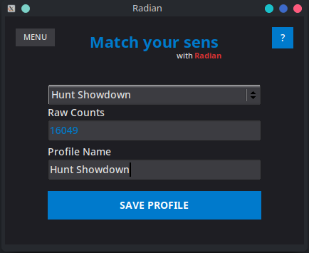

# Radian

Radian is a precision tool for Linux designed to synchronize 360-degree rotation distance across different games. By directly interfacing with the kernel's input subsystem using `uinput` and `libevdev`, Radian ensures deterministic and consistent horizontal movement, allowing users to calibrate their sensitivity precisely for each specific game.



## Usage

1. Download the .AppImage file in the Release section.
2. Executing it may ask you for your a sudo/root password. Radian needs this only once in order to set up uinput.
3. You can change any keybind within the menu tab in the App. Useful if the default ones are already in use by the game.
4. If the game allows for it, go into a local match or training session, set the center of the screen or game crosshair on top of an object as reference.
5. By default number 8 will attempt a 360, 9 decreases, 0 increases. Both 9 and 0 move by 50, while the following - and + keys allows for units (- or + 1).
6. Once you nailed the 360 in your first game, you can launch a different game and use the current 360 value by pressing 8 and adjust the sensitivity multiplier of this game to match the 360 as close as possible.
7. You can change the Profile Name and click the save profile button for future uses. All the settings and profiles shoudl be saved in a radian.cfg file.

**Note:** The radian.cfg file will store the keybinds in the first line separated by space, but any line after that represents a saved profile in a classic CSV format 'Profile Name','Raw Counts Value'.

## Getting Started

These instructions will help you get a copy of the project up and running on your local machine for development and testing purposes.

### Prerequisites

To compile and run Radian, you need a Linux environment and the **FLTK 1.4** library (you may need to compile it from source).

**System Dependencies (Solus):**
You need the development tools and libraries for Wayland, Cairo, Pango, and libevdev.

```bash
# Basic development tools
sudo eopkg install -c system.devel

# Radian and FLTK dependencies
sudo eopkg install libevdev-devel wayland-devel wayland-protocols-devel libxkbcommon-devel libcairo-devel pango-devel dbus-devel libpng-devel
```


### Building Dependencies (FLTK 1.4)

Since Radian relies on FLTK 1.4 for Wayland support and we want a static binary for AppImage portability, it is recommended to build FLTK from source.

1. Clone FLTK:
```bash
git clone [https://github.com/fltk/fltk.git](https://github.com/fltk/fltk.git)
cd fltk
mkdir build && cd build

```


2. Configure and Install (Static + Wayland):
```bash
cmake .. -G Ninja \
   -D CMAKE_BUILD_TYPE=Release \
   -D FLTK_BUILD_SHARED_LIBS=OFF \
   -D FLTK_BUILD_STATIC=ON \
   -D CMAKE_POSITION_INDEPENDENT_CODE=ON \
   -D CMAKE_INSTALL_PREFIX=/usr/local \
   -D FLTK_BUILD_TEST=OFF

ninja
sudo ninja install

```


### Installing Radian

Once dependencies are met, follow these steps to compile Radian:

1. Clone the repository:
```bash
git clone [https://github.com/diabloget/radian.git](https://github.com/diabloget/radian.git)
cd radian

```


2. Compile the binary using the provided Makefile:
```bash
make build

```

### Checking proper creation of virtual device

You should validate that the virtual device is recognized by the operating system.

```bash
# Verify the creation of the virtual device in kernel logs
dmesg | grep "Radian-Input"

```

**Note:** You can manually go into your DE's settings and look for a new "mouse" named 'Radian-Input-Device'. Disabling mouse acceleration here is recommended.

## Deployment (AppImage)

Radian uses the AppImage format to run on various distributions without dependency issues.

1. Ensure you have `appimagetool` installed. If not, download it:
```bash
wget [https://github.com/AppImage/appimagetool/releases/download/continuous/appimagetool-x86_64.AppImage](https://github.com/AppImage/appimagetool/releases/download/continuous/appimagetool-x86_64.AppImage)
chmod +x appimagetool-x86_64.AppImage
sudo mv appimagetool-x86_64.AppImage /usr/local/bin/appimagetool

```


2. Generate the distributable package:
```bash
make

```

The result will be a `Radian-x86_64.AppImage` file ready to be shared.

## Built With

* [FLTK 1.4](https://www.fltk.org/) - GUI framework (Wayland support)
* [libevdev](https://www.freedesktop.org/wiki/Software/libevdev/) - Interface for kernel event handling
* [uinput](https://kernel.org/doc/html/latest/input/uinput.html) - Kernel module for virtual input
* [Canva](https://www.canva.com/) - Application icon design

## Contributing

This is a personal project, but feel free to fork or submit an issue. If you provide a fix, I will verify it and give you credit here.

## Authors

* **Diabloget** - *Initial Work* - [diabloget](https://github.com/diabloget)

## License

This project is licensed under the GNU GPLv3 License - see the [LICENSE](https://www.google.com/search?q=LICENSE) file for details.

## Acknowledgments

* AI assistance (Gemini, Claude) used for algorithm optimization and Makefiles.
* Inspired by Kovaak's Sensitivity Matcher.
